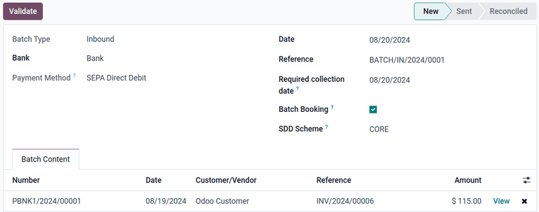

=================
SEPA Direct Debit
=================

.. |sdd| replace:: :abbr:`SDD (SEPA Direct Debit)`

SEPA, or Single Euro Payments Area, is a payment-integration initiative of the European Union for
simplifying bank transfers denominated in euros.

SEPA Direct Debit (|SDD|) is a payment provider that allows future payments to be collected from
customers' bank accounts by signing a mandate. This allows recurring payments to be automatically
gathered and processed using |sdd|.

.. important::
   |sdd| requires the **Accounting** app to be installed to create direct debit mandates.

.. _subscriptions/sepa-sdd-configuration:

Configuration
-------------

.. important::
   Before using |sdd|, the database must be configured to allow the use of Euros on sales orders. To
   do so, a :doc:`pricelist <../../point_of_sale/pricing/pricelists>` must be created for Euros.
   This can be done using the **Sales** or **Point of Sales** apps. From either app, navigate to
   :menuselection:`Configuration --> Settings --> Pricelists` and click :icon:`fa-arrow-right`
   :guilabel:`Pricelists`. Click the :guilabel:`New` button to open a new pricelist form. Add a
   name for the pricelist in the top field, then set the drop-down menu next to :guilabel:`Currency`
   to `EUR`. Click :icon:`fa-cloud-upload` (Save manually) to save the pricelist.

   .. image:: sdd/euro-pricelist.png
      :align: center
      :alt: A pricelist using EUR as the currency.

To use the wire transfer payment method, first ensure the |sdd| payment method is enabled in
Settings. This can be done by navigating to :menuselection:`Accounting app --> Configuration -->
Settings --> SEPA Direct Deposit (SDD)` and ticking the checkbox. Then, set a creditor identifier
number in the field labeled :guilabel:`Creditor Identifier`.

.. tip::
   The company using |sdd| must have a creditor identifier to issue a SEPA Direct Debit payment
   request. If using Test Mode, use the test creditor identifier number: `DE98ZZZ09999999999`.

Next, enable SEPA Direct Debit from the *Payment Providers* page in either the **Accounting**,
**Website**, or **Sales** apps.

For example, navigate to :menuselection:`Accounting app --> Configuration --> Payment Providers`,
then click the :guilabel:`SEPA Direct Debit` card.

.. tip::
   The *SEPA Direct Debit* page can also be reached by navigating to :menuselection:`Website app -->
   Configuration --> Payment Providers`, or :menuselection:`Sales app --> Configuration --> Payment
   Providers`.

Next, set the :guilabel:`State` to :guilabel:`Enabled` to enable |sdd|. Use the drop-down menus next
to the :guilabel:`Company` and :guilabel:`Website` fields to set where |sdd| can be used.

The options in the :guilabel:`Configuration` tab can be used to customize how |sdd| is used.
Optionally tick the checkbox next to :guilabel:`Enable QR Codes` to enable the use of QR codes when
paying by |sdd|, if desired.

Use the drop-down menu next to the :guilabel:`Communication` field to select the communication type
used on sales orders. Choose :guilabel:`Based on Document Reference` to use the sales order (or
invoice number), or :guilabel:`Based on Customer ID` to use the customer identifier. With either
method selected, communication is given to the customer, once they choose the |sdd| payment method.

The configuration options listed under the :guilabel:`Availability` section are used to set payment
restrictions, and are optional. Use the :guilabel:`Maximum Amount` field to set a maximum payment
value, and the :guilabel:`Countries` field to restrict payment from any particular countries, if
desired.

.. important::
   The :guilabel:`Currencies` field should be left with the default :guilabel:`EUR` tag to ensure
   |sdd| is only accessible when customers pay with Euros.

In the :guilabel:`Messages` tab, the :guilabel:`Pending Message` field can be used to add a message
that will be displayed if the order remains pending after the payment is processed. By default,
this field contains the default message: :guilabel:`Please make an unique payment transfer to
confirm the SEPA mandate.`

Once all necessary configuration settings are complete, the :icon:`fa-eye-slash`
:guilabel:`Unpublished` smart button located at the top of the page automatically changes to
:icon:`fa-globe` :guilabel:`Published` to show the |sdd| payment option is now visible to customers.
Only keep the payment method published if payments are ready to be received.

.. tip::
   It is possible to keep the payment method enabled, but **not** visible to customers, until
   payments are ready to be received. To do this, set the smart button to :icon:`fa-eye-slash`
   :guilabel:`Unpublished` after setting the :guilabel:`State` to :guilabel:`Enabled`.

.. note::
   The |sdd| configuration menu can also be accessed by navigating to :menuselection:`Settings app
   --> Website --> Shop --> Configure SEPA Direct Debit`.

Test mode
~~~~~~~~~

The |sdd| payment method can be tested before it is accessed by customers. First, ensure the test
creditor identifier is :ref:`configured <subscriptions/sepa-sdd-configuration>` in **Settings**
before continuing.

.. warning::
   It is recommended to use the :guilabel:`Test Mode` setting on a duplicate (or test) database to
   avoid potential issues with invoice numbering.

Next, select the :guilabel:`Test Mode` option in the :guilabel:`State` field on the form. Upon
selecting :guilabel:`Test Mode`, an orange :guilabel:`Test mode` banner appears in the upper-right
corner of the form.

.. note::
   By default, the payment provider remains :guilabel:`Unpublished` in :guilabel:`Test Mode`, so it
   is not visible to visitors.

Navigate to :menuselection:`Sales --> Orders --> Quotations` and click the :guilabel:`New` button
to create a new sales order. Select or create a fake customer, or add yourself, in the field next to
:guilabel:`Customer`. Select any pay period in the drop-down menu next to :guilabel:`Recurring Plan`
and select the pricelist using EUR in the drop-down menu next to :guilabel:`Pricelist`. Finally,
select a subscription product in the :guilabel:`Order Lines` tab of the sales order.

Next, confirm the sales order by clicking the :guilabel:`Confirm` button, then click the
:guilabel:`Preview` button to open a preview of the customer invoice. Scroll down to the
:guilabel:`Anticipate payment` section to find the SEPA Direct Debit payment method.

.. tip::
   It can be confirmed that test mode is still enabled if the :icon:`fa-eye-slash` (unpublished) and
   :icon:`fa-exclamation-triangle` (test mode) icons are present next to :guilabel:`SEPA Direct
   Debit`.

   .. image:: sdd/sdd-anticipated.png
      :align: center
      :alt: The view of the SEPA Direct Debit payment method presented to customers at checkout.

Next, enter a test IBAN number, such as `GB33BUKB20201555555555`, and click :guilabel:`Pay`. Return
to the sales order in the **Sales** app and confirm the :guilabel:`Pending transaction` tag is
present on the sales order form. At this point, the flow is complete.

To re-enable normal function after testing, change the :guilabel:`State` setting to
:guilabel:`Enabled`.

.. _subscriptions/sepa-sdd-payment:

Pay by SEPA Direct Debit
------------------------

Once |sdd| has been :ref:`configured <subscriptions/sepa-sdd-configuration>` and enabled, |sdd| will
appear as a payment method during checkout in **eCommerce** and as a payment method on invoices in
the **Sales** apps. The option will be presented to customers and prompt them to enter their IBAN
number.

Once a customer clicks *Pay*, the sales order is marked with a :guilabel:`Pending transaction` tag
until the mandate has been closed.

Mandates automatically close after the end date is reached. If the *End date* field is not set, the
mandate remains in an *Active* state until it is *Closed* or *Revoked*.

|sdd| payments can also be registered manually by navigating to the desired invoice and clicking the
:guilabel:`Register Payment` button. Next, select :guilabel:`SEPA Direct Debit` as the payment
method and click the :guilabel:`Create Payment` button. The invoice now displays a green
:guilabel:`In Payment` banner.

.. tip::
   To validate a successful |sdd| payment, navigate to :menuselection:`Accounting app --> Customers
   --> Payments` and look for the entry in the list, along with a :guilabel:`Posted` tag in the
   :guilabel:`Status` column.

Submit Payments
---------------

All |sdd| payments can be processed at once by uploading an `.xml` file containing a batch of all
posted |sdd| payments to an online banking interface. To generate this file, navigate to
:menuselection:`Accounting app --> Customers --> Batch Payments`. A list of all posted |sdd|
payments appears. Tick the checkbox next to every payment to be included in the batch, or tick the
checkbox at the top of the list to select all entries.

Next, click :guilabel:`Create Batch`. A new batch payment form appears with the selected payments
added to the list in the :guilabel:`Batch Content` tab.

This form also contains optional fields to customize the batch payment:

- :guilabel:`Bank`: Select the bank the payment is sent to.
- :guilabel:`Date`: Set the current date.
- :guilabel:`Reference`: Set a custom reference number for the payment.
- :guilabel:`Required collection date`: Date when the company expects to receive the payment of
  this batch.
- :guilabel:`Batch Booking`: Request batch booking from the bank for the related bank statements.
- :guilabel:`SDD Scheme`: The B2B scheme is an optional scheme, offered exclusively to business
  payers. Some banks/businesses might not accept B2B |sdd|.

Once the payment is configured, click :guilabel:`Validate` to generate the `.xml` file, which
appears in the chatter. Finally, click the :icon:`fa-download` (download) icon next to the file in
the chatter to download the file.

This file can now be uploaded to the desired online banking interface to process the payments.

.. note::
   The files generated by Odoo follow the SEPA Direct Debit **PAIN.008.001.02** specifications, as
   required by the SEPA customer-to-bank `implementation guidelines
   <https://www.europeanpaymentscouncil.eu/document-library/implementation-guidelines/sepa-credit-transfer-customer-psp-implementation>`_,
   which ensures compatibility with the banks.

.. seealso::
   - :doc:`../../../finance/accounting/payments/batch_sdd`
   - :doc:`../../../finance/accounting/payments/online`
